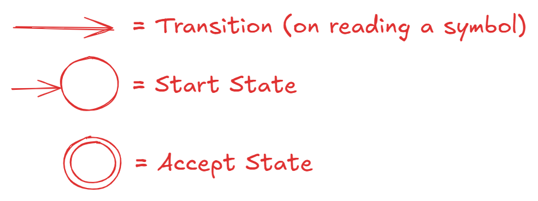

# Theory Of Computation

## Finite Automata

State Machine consists of states repreented in circles, transitions represented by arrows, Start State shown with an input arrow and accept states represented as circles with double rounding borders.

For a finite input string, the output is to either accept or reject it.

Computation Process: Begin at start state, read input symbols and follow corresponding transitions. Accept if it ends with accept state, Reject otherwise.

For a Finite Automata, set of all strings that are accepted are termed as Language of that machine M { = L(M) }, and also said that M *recognizes* this set.

By definition, a Finite Automaton M is a 5-tuple ( Q, $\Sigma$, $\delta$, q0, F ):
- Q - Finite set of states
- $\Sigma$ - Finite set of alphabetical symbols
- $\delta$ - transition function $\delta: Q \times \Sigma \rightarrow Q$
    - $\delta (q, a) = r$ means state '$q$' needs character '$a$' to move to state '$r$'.
- q0 - Start state
- F - Set of accept states

Where F can possibly be empty with size 0 as well.

String is a finite sequence of symbols in $\Sigma$. Empty string can be denoted by $\epsilon$, has length 0.

Language is a set of strings (finite or infinite). Empty language can be denoted by $\phi$, the set with no strings.

A Language is *regular* if some Finite Automaton recognizes it.

A language is not regular if it is not recognized by a FSM, or if it requires memory. Memory of Finite State Machine is limited and it cannot store or count strings.

Example of a regular language: $A = \{w|w$ has an even number of 1s $\}$. 
Example of a not regular language: $B = \{w|w$ has equal numbers of 0s and 1s $\}$.

Regular Language Operations:
- Union ($\cup$)
- Concatenation ($\circ$) - Joining strings together in the order of left operand followed by the right one.
- Star ($^\ast$)

Regular Expressions are:
1. Atomic - Built from $\Sigma$ members $\Sigma, \phi, \epsilon$
2. Composite - Uses the Regular Expression operations mentioned in the above paragraph ($\cup, \circ, ^\ast$).

Grammar is a set of rules which generates every string in a language.

Finite Automata can be classified into:
* Finite Automata with output (= Finite State Machine)
    - Mealy Machine
        - Output of Mealy Machine is dependent on the present state and present input. With output associated with each transition, the output length of Mealy Machine is of the same length as the input length.
    - Moore Machine
        - Output of Moore Machine is dependent only on present state. With output associated to each state, the output length of Moore Machine is one greater than the input length (due to initial state appending at the beginning).
* Finite Automata without output
    - Deterministic Finite Automata (DFA)
    - Non-deterministic Finite Automata (NFA)
    - $\epsilon$-NFA ($\epsilon$ indicates Empty, $\epsilon$-NFA accepts empty symbol inputs as well and unless indicated in a transition, each state remains in the same state on receiving $\epsilon$ = nothing).

Push Down Automata (PDA) is a machine with finite stack memory. Language recognized by PDA is known as Context-Free Language (CFL).

## References:

[1. Introduction, Finite Automata, Regular Expressions - MIT OpenCourseWare - YouTube](https://www.youtube.com/watch?v=9syvZr-9xwk&t=41s), [MIT OpenCourseWare Listing](https://ocw.mit.edu/courses/18-404j-theory-of-computation-fall-2020/)

## Subject Topics (from [GATE 2026 CS](https://gate2026.iitg.ac.in/doc/GATE2026_Syllabus/CS_2026_Syllabus.pdf) syllabus)

Regular expressions and finite automata. Context-free grammars and push-down automata. Regular and context-free languages, pumping lemma. Turing machines and undecidability.